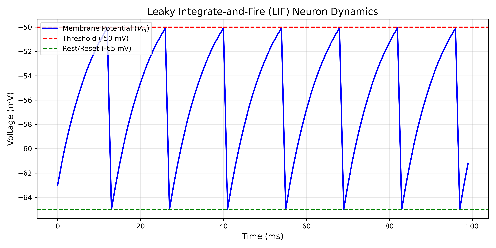
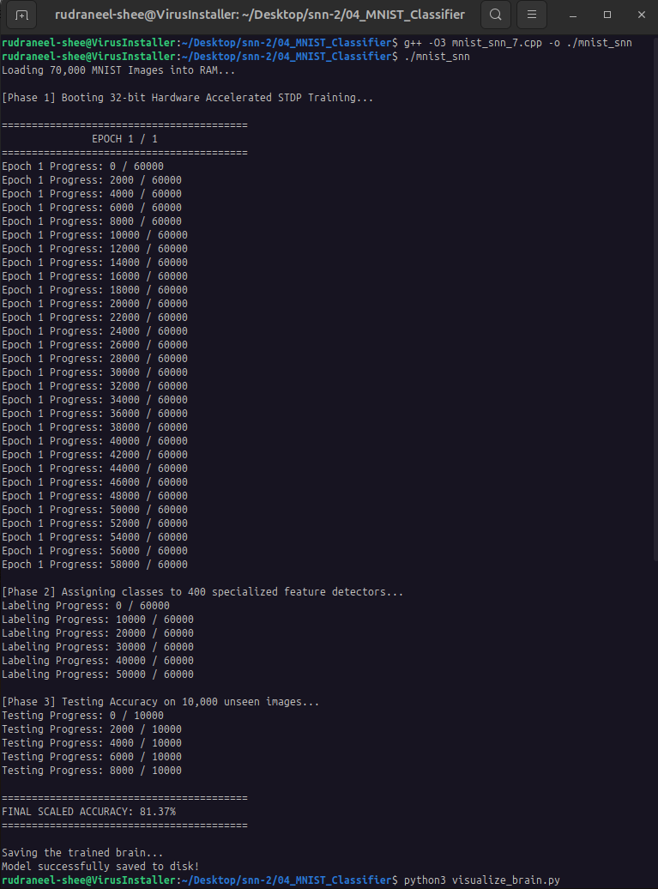
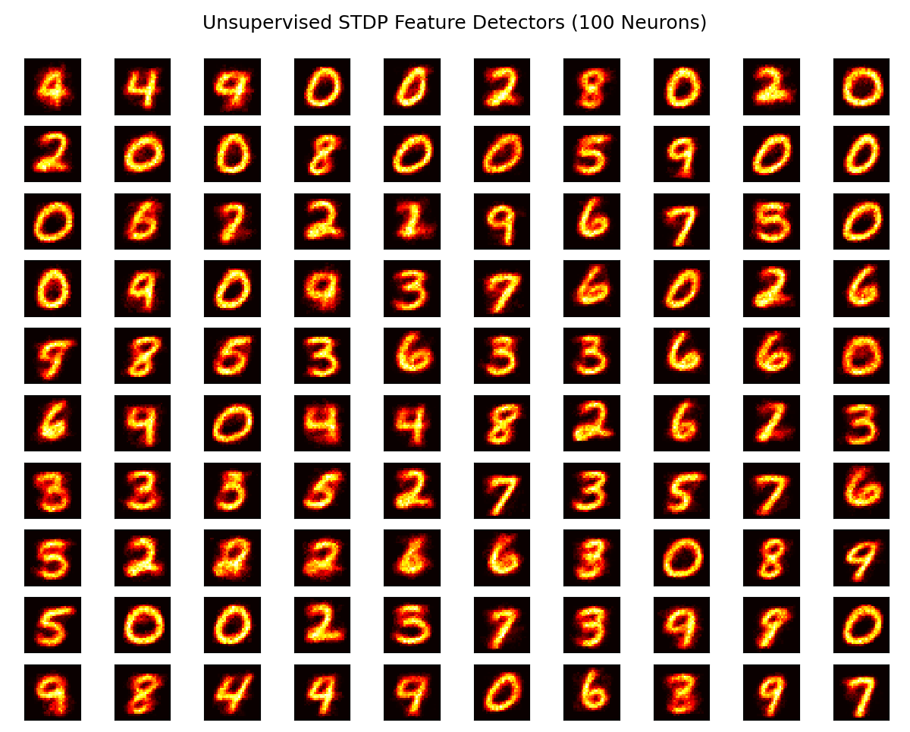
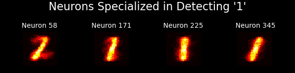
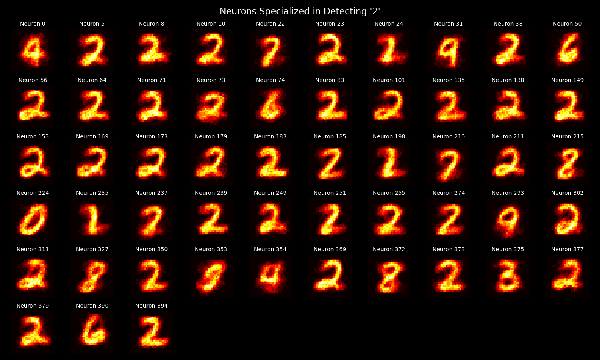
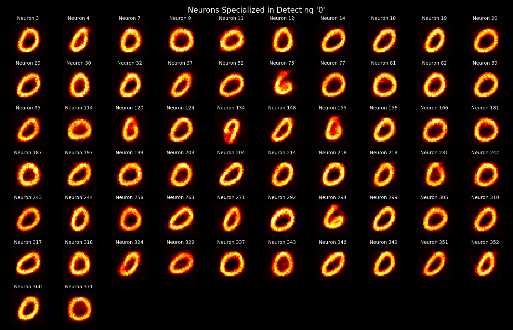

# Spiking Neural Network (SNN) Engine

**Author:** Rudraneel Shee | B.Tech Engineering Physics, IIT Patna

**GitHub:** [EigenRudra](https://github.com/EigenRudra)

**Focus:** Trying to learn about Neuromorphic Computing

## Table of Contents
* [Project Overview](#project-overview)
* [Development Architecture](#development-architecture)
* [Build Requirements](#build-requirements)
* [Part 1: The Single LIF Neuron](#part-1-the-single-lif-neuron)
* [Part 2: The Vectorized SNN Layer](#part-2-the-vectorized-snn-layer)
* [Part 3: STDP Learning (The Synapse)](#part-3-stdp-learning-the-synapse)
* [Part 4: MNIST Classification](#part-4-mnist-classification)


## Project Overview
**ONGOING PROJECT**
This repository contains currently contains my files to build a Spiking Neural Network (SNN) from scratch in C++. Rather than utilizing high-level machine learning frameworks, this project approaches neuromorphic computing from a **fundamental physics and dynamical systems** perspective, treating neurons as non-linear oscillators and learning as a causality-driven synaptic process.

## Development Architecture
I am documenting the project in the same structure I am building step by step, to ensure mathematical accuracy and computational efficiency before scaling:

* **`01_Single_LIF_Neuron/`** - Core physics engine modeling continuous RC circuit dynamics and discontinuous threshold resets.
* **`02_Vectorized_Layer/`** - Parallelizing multiple neurons with multiple channels using the C++ **Eigen** template library for matrix operations.
* **`03_STDP/`** - Implemented localized Spike-Timing-Dependent Plasticity for unsupervised temporal learning.
* **`04_MNIST_Classifier/`** - A hardware-accelerated, 400-neuron network achieving currently a maximum of **~81.37% accuracy**.

## Build Requirements

To compile the C++ engine and run the Python visualization dashboards, your system must have the following dependencies installed:

### Core C++ Engine
* **C++ Compiler**: GCC (g++) or Clang supporting **C++17** or higher.
* **Eigen Library (3.4+)**: A C++ template library for linear algebra. The engine relies heavily on Eigen for vectorized spatial integration and matrix operations.
* **OpenMP**: Required for multi-threaded hardware acceleration across CPU cores.
* **Modern CPU**: An Intel or AMD processor supporting AVX instructions (utilized via the `-march=native` compiler flag).

### Python Visualization
* **Python 3.x**
* **NumPy**: For parsing and reshaping the high-dimensional synaptic weight matrices.
* **Matplotlib**: For rendering the interactive "brain state" receptive fields.

*(Note: This project was developed and tested in a Linux/Ubuntu environment.)*

## Part 1: The Single LIF NeuronThe final engine is a competitive unsupervised classifier designed for the MNIST dataset.
The foundational unit of this network is the **Leaky Integrate-and-Fire (LIF)** neuron. It is modeled as a parallel RC circuit where the cell membrane acts as a capacitor and ion channels act as resistors.

### The Physics & Mathematics
The continuous subthreshold membrane potential `V(t)` is governed by:
`τ_m * (dV/dt) = -(V(t) - V_rest) + R * I_in(t)`

Because the simulation operates in discrete computational steps (`dt`), the continuous derivative is approximated using the **Forward Euler method**:
`V(t+dt) = V(t) + (dt / τ_m) * [ -(V(t) - V_rest) + R * I_in(t) ]`

Once the voltage crosses a defined threshold (`V_th`), the continuous integration is interrupted. A discrete spike event is recorded, and the voltage is instantaneously forced back to the reset potential (`V_reset`), creating the characteristic sawtooth wave.

### Visualization


### Build & Run Instructions (Linux/Ubuntu)
To compile the single neuron physics engine,
```bash
cd 01_Single_LIF_Neuron
g++ single_lif.cpp -o single_lif
./single_lif
```

Enter required input

For visualization, run
```bash
python3 plot_lif.py
```
----

## Part 2: The Vectorized SNN Layer

This scales the isolated LIF neuron into a fully connected, parallel processing layer. To handle the increase in computational complexity, the physics engine logic is now vectorized using the C++ **Eigen** library.

### The Physics & Mathematics
#### Spatial Integration (The Wiring)

Instead of a single injected current, neurons now receive discrete spikes from multiple input channels. The physical synapses connecting the inputs to the neurons are represented by a weight matrix $\mathbf{W}$. The total incoming current $\mathbf{I}_{in}$ for the entire layer is calculated simultaneously via matrix-vector multiplication:

$$\mathbf{I}_{in} = \mathbf{W} \cdot \mathbf{S}_{in}$$

*(Where **S**<sub>in</sub> is a binary vector representing which sensory inputs fired at the current millisecond).*

#### Temporal Integration & Asynchronous Dynamics

The Forward Euler differential equation is applied across the entire state vector of membrane potentials simultaneously.

To test the layer's biological realism, the simulation drives the network with 5 distinct sensory inputs firing at prime-number frequencies (e.g., **500 Hz, 333 Hz, 142 Hz**). This creates a chaotic, non-repeating interference pattern. Because the initial synaptic weight matrix is randomized, each neuron organically develops a unique "receptive field," demonstrating native **spatiotemporal feature extraction** - different neurons learn to spike only when specific combinations of frequencies overlap.

### Build & Run Instructions (Linux/Ubuntu)

```bash
cd 02_Vectorized_Layer
g++ -I/usr/include/eigen3 snn_layer.cpp -o snn_layer
./snn_layer
```
*(Note: If your Eigen installation is in a different directory, adjust the `-I` flag accordingly).*

---

## Part 3: STDP Learning (The Synapse)

### The Physics & Mathematics
This stage introduces **Spike-Timing-Dependent Plasticity (STDP)**, a biological learning rule where synaptic weights are modified based on the precise millisecond-scale timing of pre- and post-synaptic spikes.


#### The Plasticity Equations
The synaptic weight change $\Delta w$ is determined by the temporal difference $\Delta t = t_{post} - t_{pre}$:

* **LTP (Long-Term Potentiation):** If a pre-synaptic spike occurs just before a post-synaptic spike ($\Delta t \ge 0$), the connection is strengthened:
  $$\Delta w = A_+ \exp\left(-\frac{\Delta t}{\tau_+}\right)$$
* **LTD (Long-Term Depression):** If a pre-synaptic spike occurs after a post-synaptic spike ($\Delta t < 0$), the connection is weakened:
  $$\Delta w = - A_- \exp\left(\frac{\Delta t}{\tau_-}\right)$$

To maintain stability, the engine implements **Synaptic Clipping**, constraining weights within a defined $[w_{min}, w_{max}]$ boundary.

### Build & Run Instructions (Linux/Ubuntu)

```bash
cd 03_STDP
g++ -I/usr/include/eigen3 stdp_layer.cpp -o stdp_layer
./stdp_layer
```
*(Note: If your Eigen installation is in a different directory, adjust the `-I` flag accordingly).*
---


## Part 4: MNIST Classification

The final stage implements an unsupervised classifier for the MNIST dataset, utilizing biological learning principles to categorize handwritten digits without a labeled training signal.

### Competitive Learning Mechanism
* **STDP**: Synaptic modification is based on millisecond-scale causality, where timing determines the strength of the connection.
* **Homeostasis (Adaptive Thresholds)**: To prevent "Dictator Neurons," thresholds increase upon firing ($\theta_{plus}$). This forces the network to maintain feature diversity by allowing other neurons to compete for inputs.
* **Lateral Inhibition**: A **Winner-Take-All (WTA)** mechanism that enforces specialization across the 400-neuron layer by resetting neighboring neurons when one fires.

### Performance & Hardware Acceleration
* **Accuracy**: ~81.37% (Unsupervised classification) ( **CURRENTLY THIS IS MAXIMUM, WORKING TO INCREASE IT** )
* **Acceleration**: The engine is compiled with `-fopenmp` and `-march=native` to utilize all available CPU cores and AVX vector instructions on modern hardware.

## Build & Run Instructions (Linux/Ubuntu)

```bash
cd 04_MNIST_Classifier
g++ -O3 -fopenmp -march=native -I/usr/include/eigen3 mnist_snn.cpp -o snn_engine
./mnist_snn
```
*(Note: If your Eigen installation is in a different directory, adjust the `-I` flag accordingly).*

For viewing feature detectors for first 100 neurons, run
```bash
python3 visualize_brain.py
```

For viewing feature detectors of a particular digit from 0-9, run
```bash
python3 view.py
```

### Visualization



#### Few Specific Digits:



____

*(NOTE: `dev_log/` folder inside 04_MNIST_Classifier is NOT UPDATED. It will contain some intermediate files I created while slowly building my logic from 03_STDP_Learning to final boss level 04_MNIST_Classifier. I haven't pushed all files from my local environment to Github repo yet. WILL UPDATE SOON!)*
